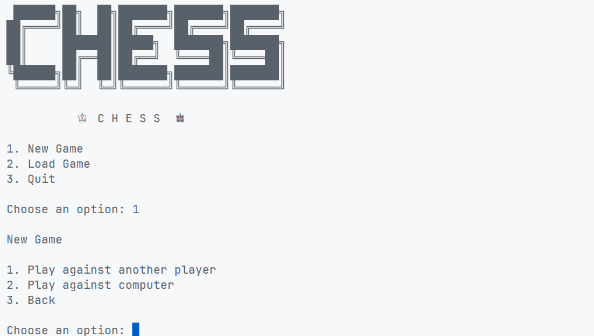
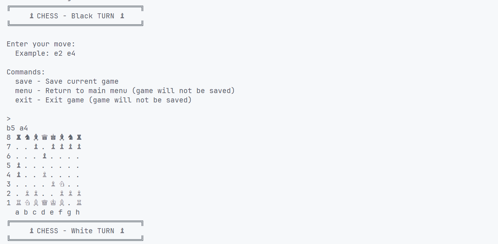

# ♟️ Chess

This is the project from [The Odin Project](https://github.com/TheOdinProject) Ruby curriculum — a command-line Chess game built with Ruby.

The game supports player vs player mode, player vs computer mode, saving/loading games, and various chess rules including check, checkmate, castling, and pawn promotion.

## ✨ Preview




## ⚙️ Installation

### 1. Clone the repository

```bash
git clone https://github.com/trietpsu29/chess.git
```

### 2. Navigate to the project folder

```bash
cd chess
```

### 3. Install Ruby

Make sure Ruby is installed on your machine.

Check your Ruby version:

```bash
ruby -v
```
If Ruby is not installed, follow the official Ruby installation guide from [The Odin Project](https://www.theodinproject.com/lessons/ruby-installing-ruby) for Linux and macOS.

Windows users can install Ruby using [RubyInstaller](https://rubyinstaller.org/).

### 4. Install dependencies

Install required gems:

```bash
bundle install
```

### 5. Run the game

Start the game:

```bash
ruby main.rb
```

## 🎮 Gameplay Instructions

- Choose a game mode:
  - Player vs Player
  - Player vs Computer

- Enter moves using chess notation:

```
e2 e4
```

The first position is the starting square and the second position is the destination square.

Example:

```
g1 f3
```

moves the knight from `g1` to `f3`.

### Available commands during a game:

```
save  - Save current game
menu  - Return to main menu (current game will not be saved)
exit  - Exit the game
```

## ♜ Supported Chess Features

- All standard chess pieces:
  - King
  - Queen
  - Rook
  - Bishop
  - Knight
  - Pawn

- Legal move validation
- Capturing pieces
- Check detection
- Checkmate detection
- Castling
- Pawn promotion
- Save and load game progress
- Simple random AI opponent

## 💾 Save and Load

The game uses JSON serialization to save and restore game states.

Saved games are stored as JSON files inside the game directory.

Saved data includes:

- Current turn
- AI player
- Board state
- King positions
- Piece positions
- Piece colors

You can save a game during a match and continue later by loading the save file from the main menu.

## 🛠️ Skills Learned

### ♦️ Ruby Basics

- Variables
- Data Types
- Arrays
- Hashes
- Methods
- Ranges
- Blocks
- Enumerable Methods
- Input and Output

### ♟️ Object Oriented Programming

- Classes and Objects
- Inheritance
- Encapsulation
- Instance and Class Methods
- Object Interaction
- Designing reusable classes

### 🧪 Testing

- RSpec
- Test Driven Development (TDD)
- Unit Testing
- Mocking and Stubbing

### 📦 Software Development

- Git and GitHub workflow
- Writing meaningful commits
- Refactoring
- Debugging
- Code organization

### 💾 Files and Serialization

- Reading and writing files
- JSON serialization
- Saving and restoring application state

## 📁 Project Structure

```
chess/
├── lib/
│   ├── board.rb
│   ├── game.rb
│   ├── menu.rb
│   └── pieces/
│
├── spec/
│
├── main.rb
├── Gemfile
└── README.md
```

## 🚀 Future Improvements

- Smarter AI using minimax algorithm
- Better terminal UI
- Multiple save slots
- Chess timer system
